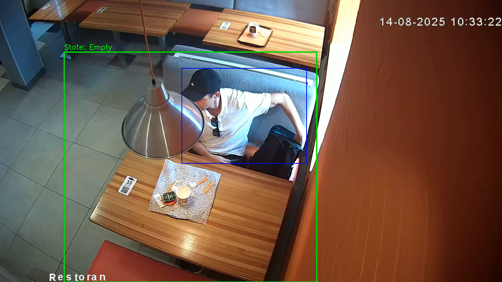

```markdown
# Прототип системы детекции уборки столиков по видео

Прототип системы компьютерного зрения для анализа загруженности столиков в пиццерии. Проект использует YOLOv8 для детекции людей и конечный автомат (State Machine) для отслеживания статуса стола.

## 🚀 Установка и запуск

1. **Клонируйте репозиторий и перейдите в папку:**
   ```bash
   git clone <ССЫЛКА_НА_ТВОЙ_РЕПОЗИТОРИЙ>
   cd <ИМЯ_ПАПКИ>
   ```

2. **Установите зависимости:**
   Проект протестирован на Python 3.10-3.12.
   ```bash
   pip install -r requirements.txt
   ```

3. **Запустите скрипт:**
   Положите целевое видео в корень проекта и выполните команду:
   ```bash
   python main.py --video "видео 2.mp4"
   ```

4. **Использование:**
   - После запуска видео встанет на паузу на первом кадре.
   - Выделите интересующий столик мышкой (зажав левую кнопку). Рекомендуется захватывать область с небольшим запасом вокруг стульев.
   - Нажмите `SPACE` или `ENTER` для подтверждения.
   - Для досрочной остановки обработки нажмите `q`.

## 📊 Данные для анализа
* **Выбранное видео:** `видео 2.mp4`
* **Выбранный столик:** Стол на переднем плане.
* **Координаты ROI (выделенной зоны):** `[x=245, y=199, w=966, h=881]` *(координаты могут немного отличаться в зависимости от выделения)*

## 🧠 Логика детекции событий
1. **Детекция людей:** Используется легковесная предобученная модель `YOLOv8n` (класс `0` - person), порог уверенности снижен до `conf=0.25` для минимизации потерь при частичном перекрытии (окклюзии).
2. **Пересечение (Intersection):** Математически вычисляется пересечение Bounding Box каждого найденного человека с выделенной зоной столика (ROI).
3. **Защита от ложных срабатываний (Debouncing):** Предобученная модель может "терять" человека на пару кадров из-за нестандартных поз (например, человек наклонился). Чтобы статус стола не "моргал", реализован буфер терпения (`PATIENCE_FRAMES` = 1.5 секунды). Статус стола меняется только если зона стабильно пуста или занята на протяжении этого времени.
4. **Аналитика:** Смена статусов пишется в список, который в конце конвертируется в `pandas.DataFrame` для расчета дельт времени.

## 📈 Полученный результат
* **Количество полных циклов (Уход -> Подход):** 6
* **Среднее время простоя столика (задержки):** **56.87 секунд**
* Итоговые файл output.mp4: https://disk.yandex.ru/i/MK4lKuXels6K5A (256 мб)

## ⚠️ Анализ проблемного кадра


**Описание проблемы:** 
На кадре выше видно ложное срабатывание (False Positive). Человек всё ещё находится за столом (собирается уходить), но система перевела стол в статус "Свободен" (зеленая рамка).
* **Причина:** Базовая модель YOLOv8n обучена на датасете COCO и лучше всего распознает людей в полный рост или стандартных позах. Когда человек совершает нестандартные движения (сливается со стулом, перекрывается курткой), уверенность модели падает ниже заданного порога, и детекция пропадает. Буфер в 1.5 секунды сглаживает мелкие потери, но при долгих сборах гостя статус успевает смениться.
* **Решение для продакшена:** Дообучение (Fine-Tuning) YOLO-модели на датасете с камер конкретной пиццерии, либо использование более тяжелой модели (YOLOv8m/l), если позволяют вычислительные мощности на точках.
```